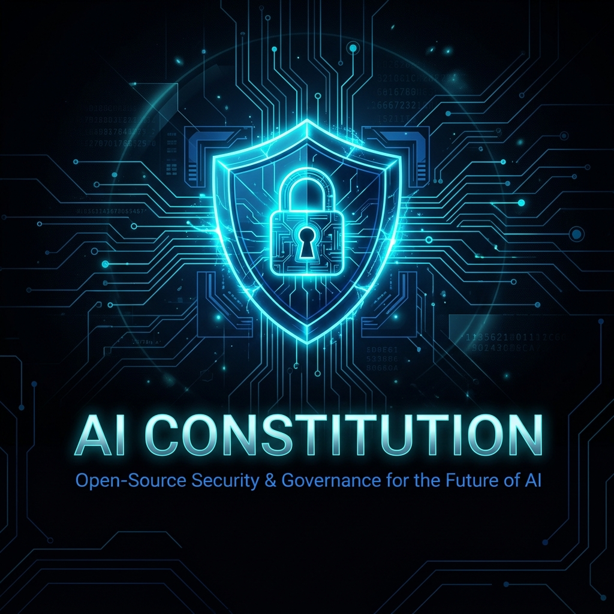
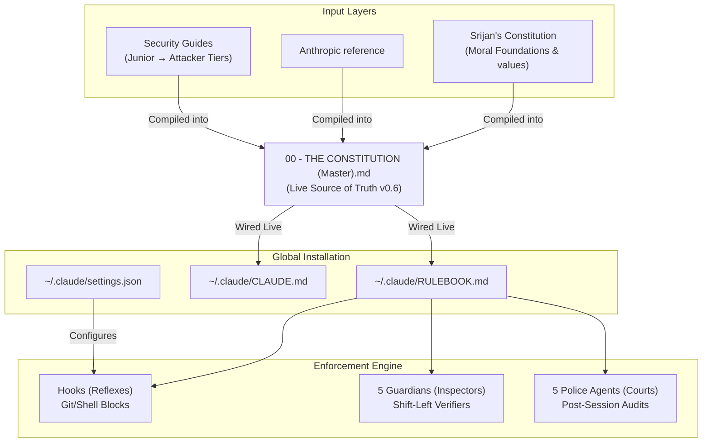

# AI Constitution — Open-Source Security & Governance



> **"One rule book every AI tool I run or ship must obey."**  
> A single, security- and privacy-forward source of truth that covers safety, honesty, privacy, security, deployment, conduct, and enforcement — globally active across all codebases and projects on your machine.

---

## 1. What is the AI Constitution?

The AI Constitution acts as the **global operating system or governance layer** for your AI development tools (specifically wired into your `~/.claude/` environment). Instead of relying on manual security practices, it implements **maximum enforcement**: the AI agent proactively scans, warns, and **blocks** insecure code, leaked secrets, or non-compliant launches *by default*, even when you didn't ask.

It is modeled on the framework of Anthropic's Claude Constitution (released under CC0) and customized with industry-standard OWASP rules, platform release gates, and developer safety reflexes.

---

## 2. System Architecture

The Constitution compiles moral values, technical guidelines, and reference standards into a single live rulebook. Here is how it is structured and integrated:



---

## 3. Live Runtime Workflow

Whenever you start an AI coding session, edit files, or execute bash commands, the Constitution governs the execution lifecycle:

```mermaid
sequenceDiagram
    autonumber
    actor Developer as Srimi (User)
    participant CLI as Claude CLI Session
    participant Hooks as Pre-Tool Hooks (Reflexes)
    participant Guardians as Proactive Guardians (Inspectors)
    participant Police as Police Patrol (Courts)
    participant Record as Tamper-Evident Record

    Developer->>CLI: Starts session / enters coding task
    Note over CLI: Loads RULEBOOK.md & setting hooks
    
    rect rgb(30, 30, 46)
        Note over CLI, Hooks: Real-Time Guard Loop
        CLI->>Hooks: Requests tool execution (e.g. run bash, edit file)
        Hooks-->>CLI: If Hard Line crossed (e.g. force-push): BLOCKS command (Exit 2)
        Hooks-->>CLI: If safe: Executes command
    end

    rect rgb(24, 24, 37)
        Note over CLI, Guardians: Shift-Left Verifications
        CLI->>Guardians: (Optional Manual Scan) Keymaster / Security Reviewer
        Guardians-->>CLI: Returns security audit & blocks unsafe commits
    end

    rect rgb(17, 17, 27)
        Note over CLI, Record: Post-Task Audit Loop
        CLI->>Developer: Task Completed
        Developer-->>Police: Stop Trigger (sentinel-patrol.sh runs)
        Police->>Record: Magistrate judges violations and writes to append-only chain
    end
```



---

## 4. The Three-Layer Enforcement Stack

The rulebook is enforced across three distinct layers:

| Layer | Type | Mechanism | Responsibilities |
| :--- | :--- | :--- | :--- |
| **1. Hooks** | *Reflexes* | Deterministic shell/git hooks (`~/.claude/hooks/`) | Intercepts commands and **instantly blocks** catastrophic actions (e.g. force-pushing, root directories deletion) before execution. |
| **2. Guardians** | *Inspectors* | Proactive, shift-left domain specialist subagents | Invoked during development to scan files and catch weaknesses before commits:<br>🔑 **Keymaster** (Secrets)<br>🛡️ **Privacy Officer** (PII/GDPR/CCPA)<br>🔬 **Security Reviewer** (OWASP/BOLA)<br>📦 **Supply-Chain Sentinel** (Dependencies)<br>🚀 **Launch Marshal** (Launch runbooks) |
| **3. Police** | *Courts* | Reactive, post-session audits logging to the Record | **Sentinel**, **Auditor**, **Magistrate**, **Warden**, and **Registrar** audit chat history and staged files, logging violations to the Record. |

---

## 5. The 10 Commandments (Developer Cheat Sheet)

If you read nothing else, obey these core directives:
1. **Never hardcode secrets**; never place them behind public prefixes (`VITE_`, `NEXT_PUBLIC_`).
2. **Public database keys require Row-Level Security (RLS)** by default.
3. **Authenticate & verify ownership server-side** on every API call (never trust a client check).
4. **Never concat user input into SQL or shell commands** (use parameterized queries/ORMs).
5. **Validate every input server-side** against an allow-list schema.
6. **Enforce HTTPS everywhere**; never disable TLS certificate validation.
7. **Verify dependency packages** exist and are canonical before running `npm install`.
8. **Lock CORS to explicit origins** (never wildcard + credentials); enable CSRF protection.
9. **Minimize PII collection**; redact personal data from logs; build real export/delete endpoints.
10. **Rate-limit sensitive endpoints** (auth/signups) and return generic authentication messages.

---

## 6. Key Features (v0.6)

* **Operational Postures (Draft vs. Prod)**:
  * *Draft Mode*: Relaxes minor security rules (CORS wildcards, debug logs, root execution) to allow rapid prototyping, while keeping core *Hard Lines* and the *Moral Soul* active.
  * *Prod Mode*: Enforces 100% compliance; blocks any warning or error before commits.
* **The Judiciary (Thinker & Council)**:
  * `/thinker`: Invokes a lightweight reasoning check for fast design verification.
  * `/council`: Invokes a 3-stage consensus panel (LLM Council) for high-stakes database migrations or major refactoring tasks.

---

## 7. Verification & Test Workspaces (Trials 1 - 5)

We established five isolated workspaces to verify and stress-test the limits of the Constitution system:

* **[Trial 1 (Reflexes)](file:///Users/srimi/Library/Mobile%20Documents/com~apple%20CloudDocs/trial1)**: Verifies that deterministic Git and Shell hooks successfully block catastrophic operations (like `git reset --hard` and `rm -rf`).
* **[Trial 2 (BOLA / IDOR)](file:///Users/srimi/Library/Mobile%20Documents/com~apple%20CloudDocs/trial2)**: Tests access control and CORS. The Security Reviewer blocks the release of a vulnerable FastAPI server until server-side ownership validations are added.
* **[Trial 3 (Secrets & TLS)](file:///Users/srimi/Library/Mobile%20Documents/com~apple%20CloudDocs/trial3)**: Tests hardcoded secrets in source files and Docker configurations, alongside disabled TLS requests (`verify=False`).
* **[Trial 4 (Logical Bypass)](file:///Users/srimi/Library/Mobile%20Documents/com~apple%20CloudDocs/trial4)**: Explores a static analysis fail-case (where a logical `None == None` check bypassed textual scanning). Verified that enforcing strict, non-nullable authentication checks patches the flaw.
* **[Trial 5 (The Ultimate Test)](file:///Users/srimi/Library/Mobile%20Documents/com~apple%20CloudDocs/trial5)**: Combines vulnerabilities across all categories (SQL Injection, IDOR, secrets, root container execution, supply-chain slopsquatting) to test Guardian coordination under Draft and Production postures.

---

## 8. Project Directory Layout

```
Constitution/
├── assets/                                  <-- Graphics and visual design assets
│   └── banner.png                           
├── report/                                  <-- Consolidated project evaluation files
│   ├── Constitution Map.md                  <-- Visual execution flow diagrams
│   ├── Self-Improving Constitution.md       <-- Loop engineering & autosave hook designs
│   ├── Self-Improving Constitution_1.md     <-- Judicial LLM Council skill designs
│   ├── remediation_report.md                <-- Vulnerability remediation code logs
│   ├── remediation_prompt.md                <-- Auto-remediation prompt template
│   └── report.md                            <-- Unbiased strengths & lags report
├── 00 - THE CONSTITUTION (Master).md        <-- Supreme single source of truth (v0.6)
├── 00 - README (Start Here).md              <-- Chronological directory navigation index
├── README.md                                <-- Public GitHub landing document
├── 01 - Old Constitution (The Real Thing)/  <-- Foundational values & Claude reference models
├── 02 - New Constitution (Security)/        <-- AI Conduct Annex + Police system prompts
├── 03 - Source Material (Security Guides)/   <-- Technical input texts (Junior to Attacker level)
└── 04 - Amendments & Versions/              <-- Version snapshot archives (v0.2, v0.3, v0.4, v0.6)
```

---

## 9. License

Released under [CC0 1.0 Universal](./LICENSE) — public domain. Use it, fork it, and adapt it for your own AI development workflows.
